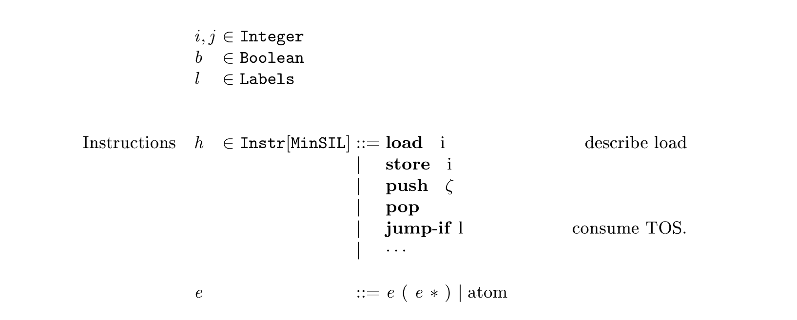

# GKD-BNF

`pip install gkdbnf`.

Maybe the most simplest way to write pretty BNF in LaTex.

Use this package with `gkdtex`:

## Usage

```tex
\gkd@bnf{
<i, j> :: Integer
<b> :: Boolean
<l> :: Labels


!Instructions! <h> :: !Instr[MinSIL]! = \mathbf{load} \; i         %%% \qquad  \qquad  describe load 
                                     |  \mathbf{store} \; i
                                     |  \mathbf{push} \; \zeta 
                                     |  \mathbf{pop}
                                     |  \mathbf{jump\mbox{-}if} l %%%   consume TOS.
                                     |  \cdots

<e> ::= <e> ( <e> * ) |  atom

}
```



## Syntax


Valid BNF Syntax:
```bnf
atom ::= NONTERMINAL
       | TERMINAL
       | TERMINAL2
       | '|'

rule        ::= '%%%' TERMINAL2
description ::=  TERMINAL | TERMINAL2
type        ::= TERMINAL | TERMINAL2 | NONTERMINAL

prod  ::= description? NONTERMINAL '::' type  '=' atom+ rule? 
      | '|' atom+ rule?

start ::= start NEWLINE
      |   start prod
      |   NEWLINE
      |   prod
```


Lexer rule by regex:
```
NEWLINE     = [\r\n]+
NONTERMINAL = <.*?>
TERMINAL2   = !.*?!
TERMINAL    = \S+
```

Whitespace tokens are ignored.

## Nice Error Report
```tex 
1:  \gkd@usepackage{gkdbnf}
2:  \gkd@bnf{
3:  <a> ::= a + 1
4:
5:  <c> ::= a a
6:  Expressions e ::= e
7: }
```

You get error

```
SyntaxError: filename runtest/a.tex:
line 6, column 13, NonTerm not match
```

Then you know you should change `Expression e` to `Expression <e>`.
